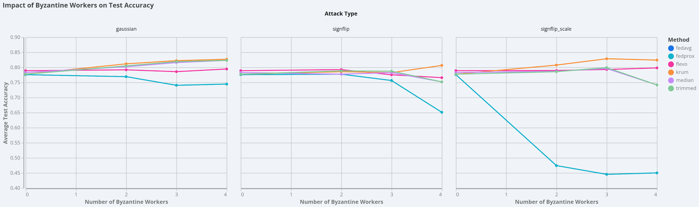

# FL-EVO: Federated Learning with Evolutionary Aggregation for EEG-Based BCIs

Federated learning for EEG motor-imagery classification, with a focus on **robust
aggregation under adversarial (Byzantine) clients**. This repository contains the
full pipeline: per-subject exploratory data analysis, the federated training code,
and a benchmark comparing the evolutionary (PSO) aggregator against standard robust
aggregation methods.

---

## Overview

Federated learning trains a shared model across many clients (here, EEG subjects)
without pooling raw data. The standard aggregator, FedAvg, simply averages client
updates — which fails when some clients send poisoned updates. This project studies
whether an evolutionary aggregator (FL-EVO, driven by Particle Swarm Optimization)
improves robustness, and benchmarks it against established robust aggregators
(coordinate-wise median, trimmed mean, Multi-Krum).

**Dataset:** PhysioNet EEG Motor Movement/Imagery (BCI2000), 109 subjects, 64 channels,
160 Hz. Binary task: Rest vs Movement.

---

## Key findings

- On clean data, all methods tie (~0.78). After per-subject z-scoring the clients
  become near-IID, so no aggregator can beat averaging — this is structural, not a
  weakness of any method.
- Under a coherent poisoning attack (sign-flip + scale), **FedAvg and FedProx collapse
  to chance (~0.45)**, while all robust aggregators hold at ~0.78–0.83.
- **Multi-Krum is the strongest method overall**, matching or significantly exceeding
  FL-EVO across attacks, with no optimizer and no server validation set required.
  Median and trimmed mean match FL-EVO up to 30% adversarial clients but degrade at 40%.



*Accuracy vs. number of Byzantine clients, per attack. Naive averaging collapses under
coherent poisoning; robust aggregation survives.*

---

## Repository structure

```
EEG-FL-EVO/
├── README.md                     # this file
├── requirements.txt
├── .gitignore
├── data/
│   └── README.md                 # how to download the PhysioNet dataset (not shipped)
├── src/
│   ├── extract_eda.py            # raw EDFs -> features + per-subject diagnostics
│   ├── byzantine_experiment.py   # FedAvg/FedProx/FL-EVO/Median/Trimmed/Krum under attack
│   └── analyze_results.py        # results CSV -> statistics + comparison figure
└── results/
    ├── eda/
    │   ├── README.md             # detailed EDA report (dataset documentation)
    │   ├── features.npz          # 128-dim features, labels, subject IDs (19,040 epochs)
    │   ├── per_subject_summary.csv / .xlsx
    │   ├── meta.json
    │   └── figures/              # EDA charts
    └── byzantine/
        ├── byzantine_results.csv # 300 runs (6 methods x 4 attacks x 4 fractions x 5 seeds)
        └── figures/              # robustness curves, distributions, heatmap
```

---

## Installation

```bash
pip install -r requirements.txt
```

Tested with Python 3.8.

---

## Usage

```bash
# 1. Extract features + per-subject EDA from the raw EDFs (needs data/dataset/, see data/README.md)
python src/extract_eda.py

# 2. Run the Byzantine robustness experiment (~3-4 min)
python src/byzantine_experiment.py

# 3. Print statistics and save the comparison figure
python src/analyze_results.py
```

All scripts resolve paths relative to the repository root, so they run from anywhere
once the dataset is in place. If you already have `results/eda/features.npz`, you can
skip step 1 and run steps 2–3 directly.

---

## Method notes

- The experiment runs in a self-contained logistic-regression harness so all six
  aggregators are compared on identical footing; the robustness *gap* between methods
  is the claim of interest.
- The FL-EVO (PSO) fitness uses a small clean server validation set; the closed-form
  baselines (median, trimmed mean, Multi-Krum) require no such set.
- PSO configuration: 30 particles, 50 iterations, ω = 0.7, c1 = c2 = 2.0. FL: 10 clients,
  30 rounds, 5 local epochs, server integration α = 0.5. FedProx μ = 0.01.

---

## Dataset

The raw EEG data is **not** included (it is large and redistributable from PhysioNet).
See [`data/README.md`](data/README.md) for download instructions.
