# FL-EVO Dataset README — PhysioNet BCI2000 (EEG Motor Imagery)

Exploratory data analysis and data documentation for the EEG dataset used in
**FL-EVO: Federated Learning with Evolutionary PSO Aggregation for EEG-Based
Brain-Computer Interfaces**. This README documents the dataset, the extraction
pipeline, the per-subject diagnostics, and every chart produced from them, so the
state of the data can be assessed at a glance and the next experimental step
decided.

---

## 1. Dataset at a glance

| Property | Value |
|---|---|
| Source | PhysioNet *EEG Motor Movement/Imagery Dataset* (`eegmmidb`), recorded with BCI2000 |
| Total subjects | 109 (S001–S109) |
| Subjects used | **106** (3 excluded, see §6) |
| Channels | 64 EEG, 10–10 montage |
| Sampling rate | 160 Hz |
| Format | EDF+ |
| Runs used | R03, R04, R07, R08, R11, R12 (left/right fist: real + imagined) |
| Task | Binary — **Rest vs Movement** |
| Epochs (total) | 19,040 (9,545 rest / 9,495 movement) |
| Epochs per subject | ~180 (mean 179.6, range 174–194) |
| Class balance | ~0.50 throughout (range 0.483–0.500) |
| Feature space | 128-dim mu+beta log-variance (64 ch × 2 bands) |

---

## 2. Source and provenance

The data originates from the PhysioNet EEG Motor Movement/Imagery Dataset,
collected using the BCI2000 instrumentation system. Each volunteer performed motor
and motor-imagery tasks while 64-channel EEG was recorded at 160 Hz. The full
release contains 14 runs per subject: two one-minute baselines plus three runs each
of four tasks. This project uses only the **left/right-fist** runs in both the
executed and imagined conditions.

| Run | Condition | Movement type |
|---|---|---|
| R03, R07, R11 | Executed | Open/close left or right fist |
| R04, R08, R12 | Imagined | Open/close left or right fist |

Annotations are `T0` (rest), `T1` (onset of left-fist action), and `T2` (onset of
right-fist action).

---

## 3. Task definition

The classification target is **binary Rest vs Movement**:

- **Rest (label 0)** = `T0` segments
- **Movement (label 1)** = `T1` ∪ `T2` segments (left and right fist pooled)

Each annotated segment is epoched over a **0–4 s** window relative to onset, with no
baseline correction.

---

## 4. Feature extraction

For each epoch, the continuous signal is band-pass filtered into two bands, then the
log-variance is computed per channel:

- **Mu band:** 8–13 Hz
- **Beta band:** 13–30 Hz
- **Feature vector:** `log(var)` over time, per channel, per band → 64 × 2 = **128 features**

Per-subject z-scoring is applied for the within-subject separability evaluation.
The raw (un-z-scored) log-variance features are retained in `features.npz` so that
absolute power differences between subjects remain available for heterogeneity
analysis.

Within-subject separability is measured by a **linear SVM under 5-fold stratified
cross-validation**, z-scoring inside each fold to avoid leakage.

---

## 5. Data dictionary — `per_subject_summary.csv` / `.xlsx`

One row per subject (106 rows).

| Column | Meaning |
|---|---|
| `subject` | Subject ID (S001–S109) |
| `n_epochs` | Total usable epochs |
| `n_rest` | Rest epochs (label 0) |
| `n_move` | Movement epochs (label 1) |
| `class_balance` | Fraction of movement epochs (≈0.50 = balanced) |
| `svm_acc` | Within-subject 5-fold CV linear-SVM accuracy — **primary signal-quality metric** |
| `erd_mu` | Mu event-related desynchronization at C3/Cz/C4; (move − rest)/rest. **Negative = healthy suppression** |
| `erd_beta` | Same for the beta band |
| `mean_mu_logvar` | Mean mu log-variance (absolute power level) |
| `mean_beta_logvar` | Mean beta log-variance |
| `feat_std` | Spread of the feature distribution |
| `max_amp_uV` | Peak signal amplitude (µV) — artifact proxy |
| `n_flat_ch` | Count of flat/dead channels (0 for all subjects) |
| `n_runs_used` | Runs successfully loaded (6 for all retained subjects) |

---

## 6. Excluded subjects

| Subject | Reason |
|---|---|
| S088 | All runs recorded at 128 Hz (off-spec) |
| S092 | All runs recorded at 128 Hz |
| S100 | All runs recorded at 128 Hz |

These are a documented quirk of the PhysioNet release, not a pipeline fault. All
other 106 subjects loaded all six runs cleanly with no flat channels.

---

## 7. Key findings

1. **Signal exists but is unevenly distributed.** Mean separability is 0.737, ranging
   from chance (0.52) to 0.97. Only two subjects (S078, S107) sit at chance.

2. **The original fixed pool was the Run 1 problem.** Subjects S001–S010 averaged
   0.727 — the population mean — held back by genuinely weak subjects (S010 = 0.589,
   S006 = 0.606). Selecting the top performers raises the working pool to ~0.86–0.89.

3. **Separability is only loosely tied to canonical motor ERD.** `erd_mu` correlates
   weakly with accuracy (−0.17), `erd_beta` more strongly (−0.45), and ERD *magnitude*
   correlates positively (0.33). 86/106 subjects show correct-sign mu suppression; 20
   show the wrong sign. Part of this is a windowing artifact (the 0–4 s epoch dilutes
   the ERD, which peaks ~0.5–2.5 s, and C3/Cz/C4 averaging washes out lateralization).

4. **Clients are extremely non-IID — but along a single axis.** Between-subject
   variance is **11×** within-subject variance, yet one principal component captures
   **90%** of all between-subject variation. That dominant axis is a per-subject
   power/scale offset.

5. **This explains the clean-data FedAvg ≡ FL-EVO tie.** Per-subject z-scoring (needed
   for accuracy) collapses exactly that PC1 offset axis, leaving the clients near-IID in
   the dimensions the classifier uses. Near-IID is the regime where averaging is optimal
   and no aggregator can separate on clean data. **The tie is structural, not a PSO bug.**

---

## 8. Visualizations

All charts below were produced from `per_subject_summary.csv` / `features.npz`.
Images live in `figures/`.

### 8.1 Separability distribution

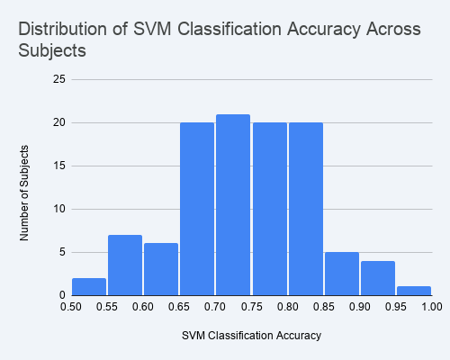

Distribution of within-subject SVM accuracy across the 106 subjects. The bulk sits
between 0.65 and 0.85; a long right tail of strong subjects reaches 0.97. This is the
single most important quality view — it shows how much usable signal each client carries.

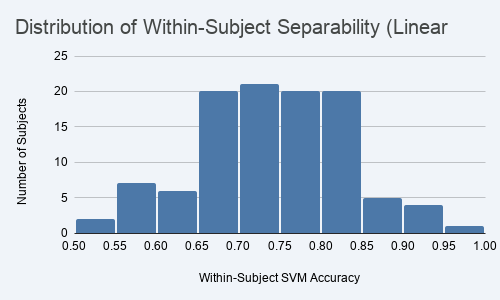

A second view of the same separability distribution (within-subject SVM accuracy).

### 8.2 Motor signal (ERD) vs separability

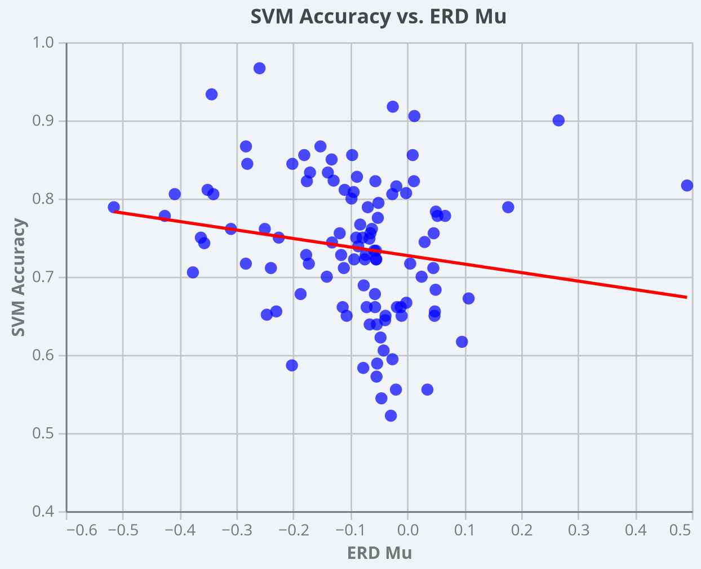

SVM accuracy against mu-band ERD, with a fitted trend line. The slope is mild —
mu ERD alone does not strongly predict separability (r ≈ −0.17).

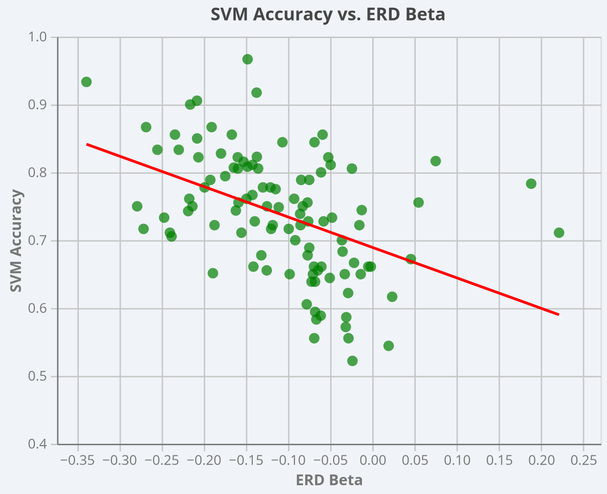

The beta-band version shows a steeper negative trend (r ≈ −0.45): subjects with
stronger beta suppression tend to be more separable.

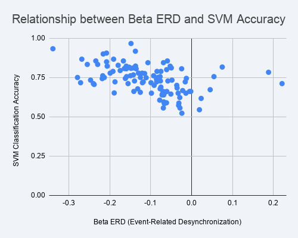

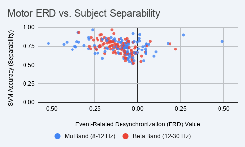

Mu (blue) and beta (red) ERD overlaid against separability. The vertical line at 0
marks the boundary between healthy suppression (left) and wrong-sign subjects (right).

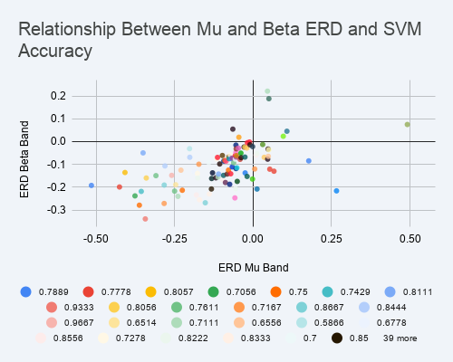

Joint mu–beta ERD scatter, colored per subject. Most subjects cluster in the
lower-left quadrant (both bands suppressed).

### 8.3 Inter-subject heterogeneity

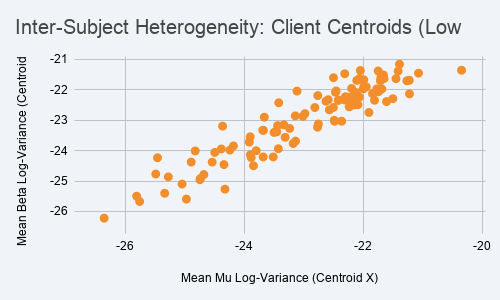

Per-subject centroids in mean mu vs mean beta log-variance. The tight diagonal
correlation is the visual signature of the **low-rank, single-axis heterogeneity** —
subjects differ mostly in overall power level, not in band-specific structure.

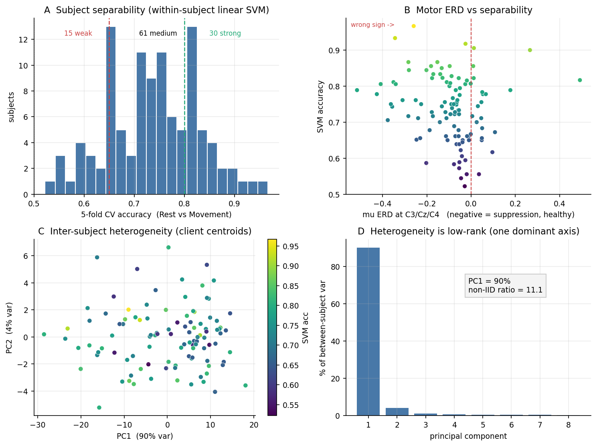

Consolidated diagnostic: (A) separability with quality tiers, (B) ERD vs separability,
(C) client centroids in PC space colored by accuracy, (D) the scree plot showing PC1
explains 90% of between-subject variance.

### 8.4 Quality-control checks

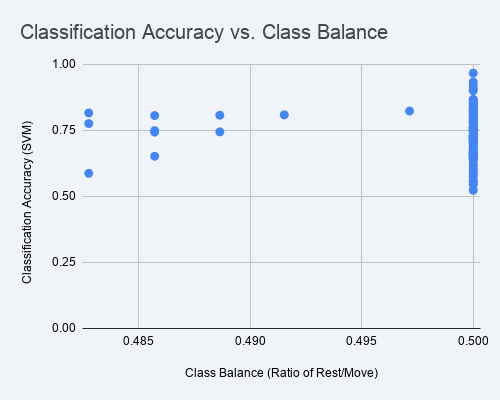

Accuracy against class balance — balance is pinned near 0.50, so no subject is
confounded by skewed classes.

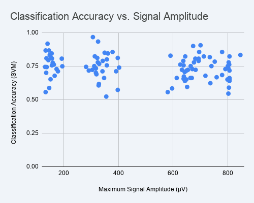
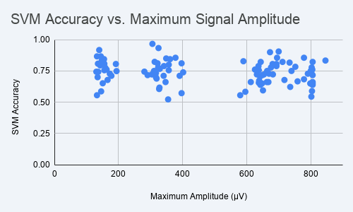

Accuracy against amplitude proxies — no strong dependence, i.e. separability is not
being driven by high-amplitude artifacts. (The three amplitude clusters reflect
recording-gain groups, not signal quality.)

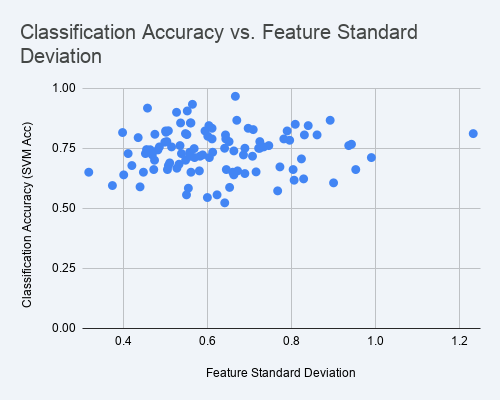
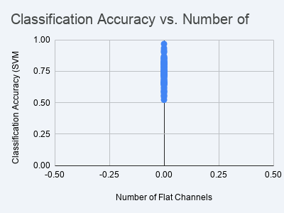

Feature spread shows a mild positive relationship; flat-channel count is 0 for every
subject (clean recordings).

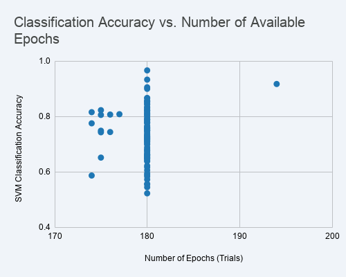

Epoch counts are tightly clustered (~180), so trial count is not a confound.

---

## 9. Subject quality tiers

| Tier | Criterion | Count |
|---|---|---|
| Strong | SVM ≥ 0.80 | 30 |
| Medium | 0.65 ≤ SVM < 0.80 | 61 |
| Weak | SVM < 0.65 | 15 |

**Strong pool (n = 30, recommended for federated clients):**
S004, S033, S089, S045, S032, S025, S042, S022, S069, S015, S007, S062, S098, S094,
S055, S049, S104, S028, S068, S043, S046, S102, S024, S014, S051, S041, S034, S056,
S048, S002

**Top 20 (mean acc 0.862):** S004, S033, S089, S045, S032, S025, S042, S022, S069,
S015, S007, S062, S098, S094, S055, S049, S104, S028, S068, S043

**Weak — avoid (SVM < 0.65):** S108, S099, S101, S009, S066, S006, S040, S010, S076,
S087, S109, S038, S047, S107, S078

---

## 10. Decision guidance

What the data does and does not settle:

- **Subject selection is settled.** Use the strong/top-20 pool as federated clients.
  The fixed S001–S010 pool should not be used — it caused the Run 1 underperformance.

- **The clean-data FedAvg ≡ FL-EVO tie is explained and defensible.** It follows from
  the near-IID structure left after z-scoring. If the supervisor reads the tie as
  "PSO adds nothing," §7.4–7.5 is the rebuttal: no aggregator can win there, so the tie
  is expected, not a defect.

- **The PSO decision is NOT settled by this EDA.** Natural heterogeneity and adversarial
  robustness are different axes; z-scoring removes the former but not the latter. PSO's
  value lives entirely in the **Byzantine condition**, which dataset statistics cannot
  evaluate. The deciding number is a **corrected-fitness FL-EVO vs FedAvg run under
  Byzantine attack on real EEG**. Until that exists, neither keeping nor dropping PSO is
  data-supported.

- **Optional refinement.** Tightening the epoch window to ~0.5–2.5 s would sharpen ERD
  and likely improve the ERD-vs-separability relationship — worth doing before final
  figures if reviewers may probe neurophysiological grounding.

**Recommended next action:** run the fitness-fixed pipeline on the strong pool under
Byzantine conditions, 5 seeds, paired t-test. That single result resolves the PSO
question either way.

---

## 11. Files in this release

| File | Contents |
|---|---|
| `README.md` | This document |
| `per_subject_summary.csv` / `.xlsx` | Per-subject diagnostics (106 rows) |
| `features.npz` | Raw 128-dim log-variance features, labels, subject IDs (19,040 epochs) |
| `meta.json` | Extraction config, channel list, excluded-record log |
| `extract_eda.py` | Extraction script (reproduces all of the above) |
| `figures/` | All charts referenced in §8 |
